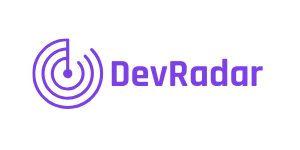

<h1 align="center">
    
</h1>

  

  <a href="#rocket-tecnologias">Tecnologias</a>&nbsp;&nbsp;&nbsp;|&nbsp;&nbsp;&nbsp;
  <a href="#-projeto">Projeto</a>&nbsp;&nbsp;&nbsp;|&nbsp;&nbsp;&nbsp;
  <a href="#-como-contribuir">Como contribuir</a>&nbsp;&nbsp;&nbsp;|&nbsp;&nbsp;&nbsp;
  <a href="#memo-licença">Licença</a>

 

  

## :rocket: Tecnologias

Esse projeto foi desenvolvido com as seguintes tecnologias:

- [Node.js](https://nodejs.org/en/)
- [Express.js](https://expressjs.com/pt-br/)
- [MongoDB](https://www.mongodb.com/)
- [React](https://reactjs.org)
- [Expo](https://expo.io/)
- [React Native](https://facebook.github.io/react-native/)
- [Socket.IO](https://socket.io/)

## 💻 Projeto

O DevRadar é um projeto que visa permitir a localização de Devs com determinadas Tecnologias

## 🤔 Como contribuir

- Faça um fork desse repositório;
- Cria uma branch com a sua feature: `git checkout -b minha-feature`;
- Faça commit das suas alterações: `git commit -m 'feat: Minha nova feature'`;
- Faça push para a sua branch: `git push origin minha-feature`.

Depois que o merge da sua pull request for feito, você pode deletar a sua branch.

## :memo: Licença

Esse projeto está sob a licença MIT. Veja o arquivo [LICENSE](LICENSE.md) para mais detalhes.

---

Feito por Daniel Sousa :wave: [LikedIn](https://www.linkedin.com/in/danielsousast/)